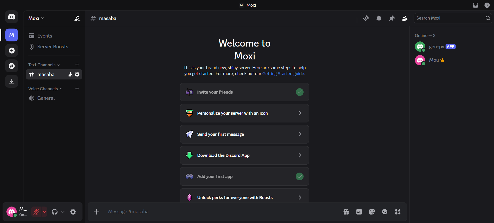
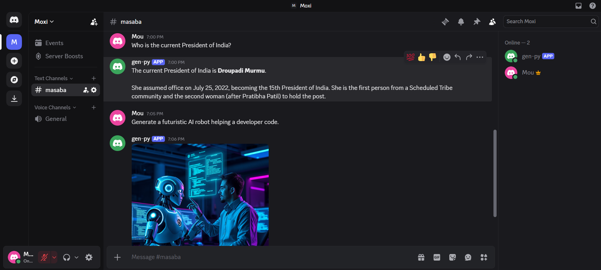

# 🤖 Moxi — AI-Powered Discord Assistant

Moxi is an AI-powered Discord assistant that combines conversational AI, real-time web search, and AI image generation into a single Discord bot.

## ✨ Features

- 💬 **AI Chat** — Powered by Google Gemini
- 🌐 **Web Search** — Uses Tavily to retrieve up-to-date information
- 🖼️ **Image Generation** — Generates images using Hugging Face and FLUX.1-schnell
- 🤖 **AI Agent** — LangChain agent intelligently selects the appropriate tool
- 💬 **Discord Integration** — Interact with Moxi directly through Discord

## 🛠️ Tech Stack

- Python
- Discord.py
- Google Gemini
- LangChain
- Tavily
- Hugging Face
- FLUX.1-schnell

## 🏗️ Architecture

```text
                    Discord User
                         │
                         ▼
                  ┌─────────────┐
                  │    Moxi     │
                  │ Discord Bot │
                  └──────┬──────┘
                         │
                         ▼
                 ┌───────────────┐
                 │ LangChain     │
                 │ AI Agent      │
                 └───────┬───────┘
                         │
                    Google Gemini
                         │
              ┌──────────┼──────────┐
              ▼          ▼          ▼
          AI Chat     Tavily     Hugging Face
                       Search        │
                                    ▼
                              FLUX.1-schnell
                                    │
                                    ▼
                              Generated Image
                                    │
                                    ▼
                                  Discord
```

## 📸 Moxi in Action

Moxi brings conversational AI and image generation directly into Discord.

### 🟢 Discord Integration



### 🤖 AI Chat & Image Generation



## 🔗 LinkedIn

📢 **Check out the project post on LinkedIn:**  
[View Moxi on LinkedIn](https://lnkd.in/p/dq7JAb88)

## 🚀 Future Enhancements

Moxi is designed to be extensible, with several improvements planned for future versions:

- 🧠 **Conversation Memory** — Maintain context across conversations
- 🎙️ **Voice Interaction** — Enable voice-based communication
- ⚡ **Discord Slash Commands** — Introduce dedicated bot commands
- 🛡️ **AI-Powered Moderation** — Assist with server moderation and safety
- 🎨 **Advanced Image Generation** — Support additional image-generation controls
- 🔌 **More AI Tools** — Integrate additional APIs and AI capabilities
- ☁️ **Cloud Deployment** — Run Moxi continuously on a cloud platform
- 📊 **Usage Monitoring** — Track bot activity, requests, and tool usage

---

## 👩‍💻 Author

**Mousumi Badyakar**
